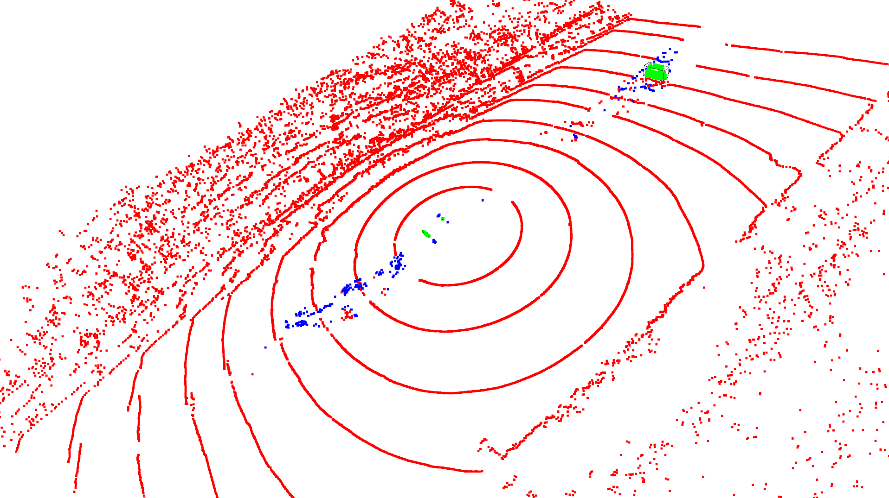
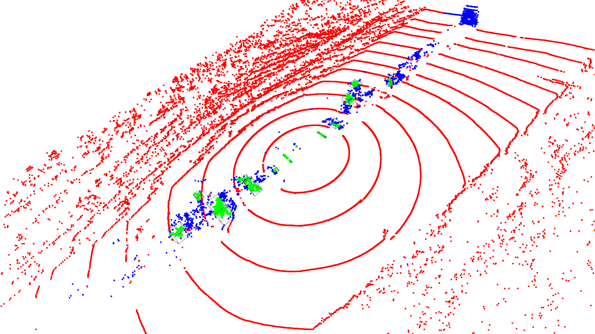
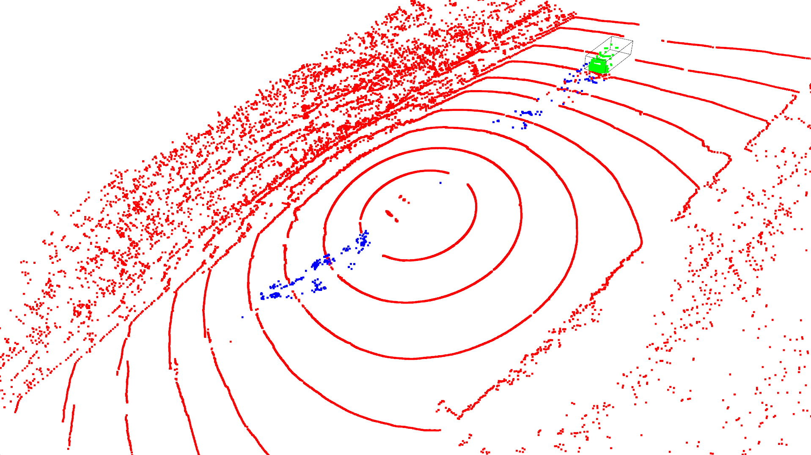
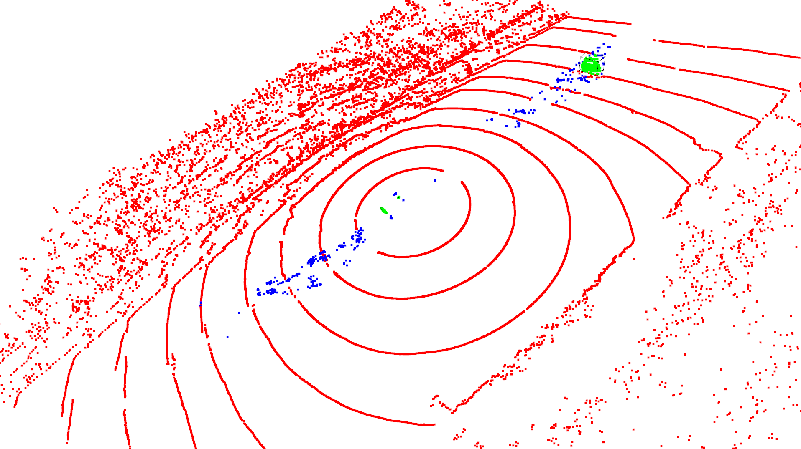
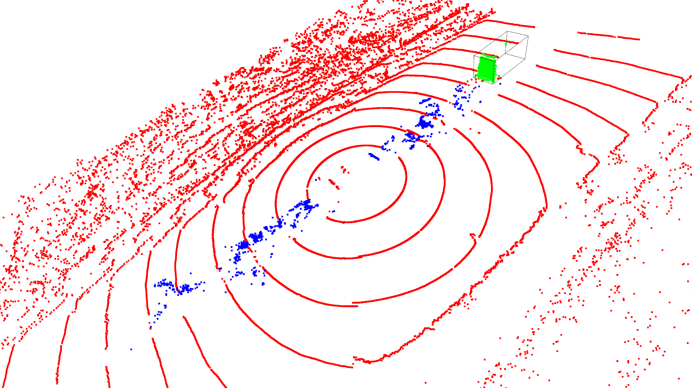
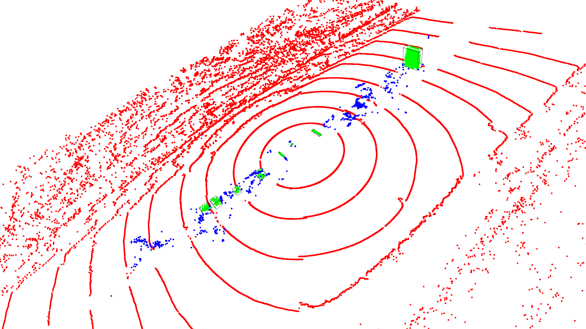
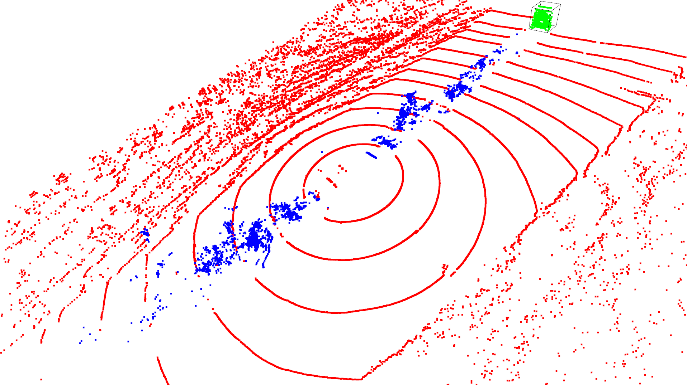
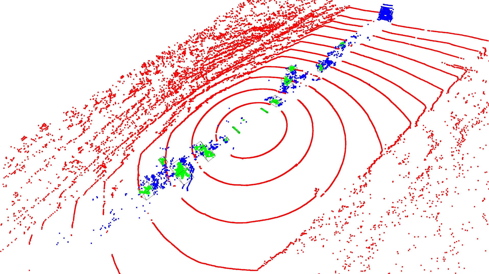
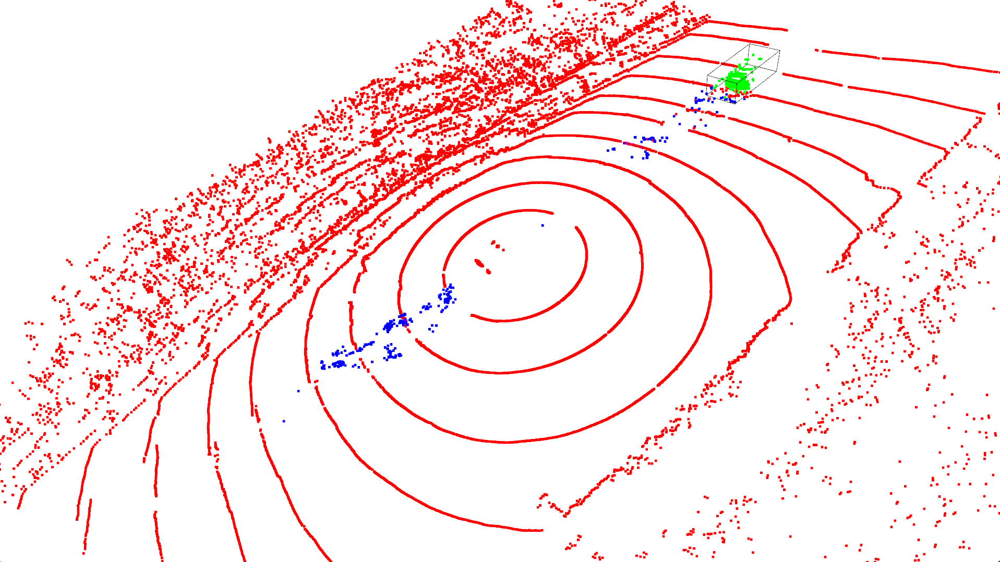

# Задача

Проезжающие машины в дождливое время образуют вокруг себя облако брызг, которые препятствуют нормальной езде беспилотного автомобиля.
Требуется предложить и реализовать модель, которая будет классифицировать точки на 3 класса:
- 0: фон
- 1: машина
- 2: шум (брызги и выхлопные газы)

Для обучения и тестирования модели рекомендуется использовать датасет [semantic_spray_dataset](https://github.innominds.com/aldipiroli/semantic_spray_dataset).  
В архиве приведен jupyter-ноутбук с примером загрузки облака с разметкой из этого датасета и их дальнейшей визуализацией.

Упрощения, которые можно использовать:
- допускается рассматривать точки только в непосредственной близости от автомобиля (например, x в пределах [-20; 20], y в пределах [-20, 20])
- допускается удалять точки земли по порогу, RANSAC'ом или иным способом
- допускается предварительно использовать алгоритм кластеризации (например, DBSCAN) и дальше определять классифицировать кластеры вместо точек.

Требования:
- Язык реализации python
- Время работы алгоритма: <= 50 мс (допускается до 100 мс)

Формат ответа:
- В качестве ответа требуется прикрепить ссылку на гитхаб с решением или загрузить код файлом или архивом.  
- Также нужно приложить 1-2 скрина с качеством работы модели.  
- Если модель обучалась, то будут полезны метрики обученной модели (mAP или иные)

Срок выполнения задачи - 1 неделя

# Решение

### Первый метод (RANSAC planar segmentation + DBSCAN clustering)

`Сразу стоит отметить, что данный метод предполагает достаточно много условностей и не был проанализирован до конца. Предпочтение было отдано другому методу, рассмотренному в дальнейшем.`

Предобработка:
- из исходного облака точек вырезается область, для которой $|x| < 30$ и $|y| < 30$ (если вырезать область $|x| < 20$ и $|y| < 20$, то в неё почти никогда не попадает транспортное средство)

Предположения (они же упрощения):
- предполагается, что машина и шумы находятся в узкой полосе  $-7 < y < 7$ (значения получены как 10% квантиль минимальных координат шумов из обучающей выборки и 90% квантиль максимальных координат). Также определять данную область можно с помощью кластеризации DBSCAN, однако данный метод на практике работает дольше 50ms и сильно чувствителен к гиперпараметрам.
- предполагается, что машина - достаточно плотный кластер, который можно отделить от шумов с помощью DBSCAN с достаточно малым парметром $\varepsilon$ (как будет видно далее, предположение не всегда корректно; например, при очень большом количестве плотных шумов). В действительности стоит использовать предположение как о плотности, так и о структурированности кластера. 
- предполагается, что центральные точки $|x| < 2$ и $|y| < 2$, отвечающиее за транспортное средство с лидаром, можно по-умолчанию относить к классу 0. В далее представленных методах данный случай не будет обрабатываться отдельно.  

Далее будут предложены 2 достаточно близких по сути варианта, отличающихся порядком выполнения действий. 

### Вариант 1:
1) С использованием алгоритма RANSAC из облака точек отделяются точки поверхности 
2) Отделяется центральная полоса (дорога), для которой $-7 < y < 7$. Точки вне дороги относятся к классу 0 (фон)
3) Точки внутри полосы (дороги) кластеризуются с использованием алгоритма DBSCAN с малым значением параметра  $\varepsilon$ для отделения машины от шумов 

|Оригинальное облако|RANSAC + DBSCAN, V1 (предсказание)|
|-|-|
|Тестовый сэмпл|Тестовый сэмпл (предсказание)|
| | |
|Сэмпл из тестового датсета|Сэмпл из тестового датсета (предсказание)|
| | |
|Сэмпл из обучающего датсета|Сэмпл из обучающего датсета (предсказание)|
| | |

Среднее время на одно предсказание для модели RANSAC + DBSCAN (Intel i9 12900K):
1) для облака точек в области $|x| < 20$ и $|y| < 20$ ~ 28ms
2) для облака точек в области $|x| < 30$ и $|y| < 30$ ~ 34ms 

### Вариант 2:
1) Отделяется центральная полоса (дорога), для которой $-7 < y < 7$. Точки вне дороги относятся к классу 0 (фон)
2) С использованием алгоритма RANSAC из центраьной полосы отделяются точки поверхности 
3) Точки внутри полосы (дороги) и над поверхностью кластеризуются с использованием алгоритма DBSCAN с малым значением параметра $\varepsilon$ для отделения машины от шумов 

|Оригинальное облако|RANSAC + DBSCAN, V2 (предсказание)|
|-|-|
|Тестовый сэмпл|Тестовый сэмпл (предсказание)|
| | |
|Сэмпл из тестового датсета|Сэмпл из тестового датсета (предсказание)|
| | |
|Сэмпл из обучающего датсета|Сэмпл из обучающего датсета (предсказание)|
| | |

Среднее время на одно предсказание для модели RANSAC + DBSCAN (Intel i9 12900K):
1) для облака точек в области $|x| < 20$ и $|y| < 20$ ~ 26ms
2) для облака точек в области $|x| < 30$ и $|y| < 30$ ~ 32ms 

### Вывод по RANSAC + DBSCAN

Как можно видеть, при большом числе шумов точность предложенного алгоритма достаточно низкая. 
Плотные скопления шумов классифицируются как транспортные средства. 
Очевидно, что требуется построение дополнительной модели для классификации полученных кластеров.

Таким образом, было решено переходить сразу к end-to-end алгоритмам. 
- Во-первых, время работы алгоритма RANSAC с последующей сегментацией с помощью DBSCAN уже составляет 25ms на одно "обрезанное" облако (если применять кластеризацию и к обочине, то время порядка 50ms)
- Во-вторых, при построении алгоритма было принято много условностей  
  

## PointNet++ и DGCNN

Далее будут рассмотрены 2 deep learning подхода к сегментации облака точек (будут рассмотрены готовые реализации моделей на pytorch с некоторыми доработками). 

Код модели PointNet++ и цикла её обучения были взяты из репозитория [PointNet++](https://github.com/yanx27/Pointnet_Pointnet2_pytorch)

Код модели DGCNN и цикла её обучения были взяты из репозитория [DGCNN](https://github.com/antao97/dgcnn.pytorch)

Разбиение датасета на обучающую и тестовую части было взято из репозитория [semantic_spray_dataset](https://github.innominds.com/aldipiroli/semantic_spray_dataset), полный датасет был загружен из источника [Data](https://oparu.uni-ulm.de/xmlui/handle/123456789/48891)

Помимо координатных каналов xyz в моделях будут использоваться каналы ring и intensity -> всего 5 каналов

## Второй метод (модель PointNet++)

|Оригинальное облако|PointNet++ (предсказание)|
|-|-|
|Тестовый сэмпл|Тестовый сэмпл (предсказание)|
| | |
|Сэмпл из тестового датсета|Сэмпл из тестового датсета (предсказание)|
| | |

Среднее время на одно предсказание для модели PointNet++ (RTX 2070 SUPER):
1) для облака точек в области $|x| < 20$ и $|y| < 20$ ~ 1.3s
1) для облака точек в области $|x| < 30$ и $|y| < 30$ ~ 1.6s

### Вывод по PointNet++

Плюсы: 
- неплохая точность алгоритма

Минусы:
- очень долгий инференс > 1s

Метрики качества:
|Класс|Вес класса|IoU|
|-|-|-|
|background|0.971|0.998|
|foreground|0.011|0.965|
|noise|0.018|0.925|

## Третий метод (модель DGCNN)

|Оригинальное облако|DGCNN (предсказание)|
|-|-|
|Тестовый сэмпл|Тестовый сэмпл (предсказание)|
| | |
|Сэмпл из тестового датсета|Сэмпл из тестового датсета (предсказание)|
| | |

Среднее время на одно предсказание для модели DGCNN (RTX 2070 SUPER):
1) для облака точек в области $|x| < 20$ и $|y| < 20$ ~ 49ms
2) для облака точек в области $|x| < 30$ и $|y| < 30$ ~ 68ms 

### Вывод по DGCNN

Плюсы: 
1) неплохая точность алгоритма 
2) приемлемый инференс `~49ms` на ограниченном облаке точек

Минусы:
1) всё ещё медленный инференс для полного облака точек

Метрики качества:
|Класс|Вес класса|IoU|
|-|-|-|
|background|0.971|0.999|
|foreground|0.011|0.972|
|noise|0.018|0.933|

## Вывод:

В качестве финального алгоритма предлагается использование модели DGCNN, которая в рамках данной задачи удовлетворяет поставленным условиям. 
Модель показывает высокое качество сегментации для всех трёх классов (по метрике IoU и визуально), а также инференс модели на ограниченном облаке точек менее 50ms. 
